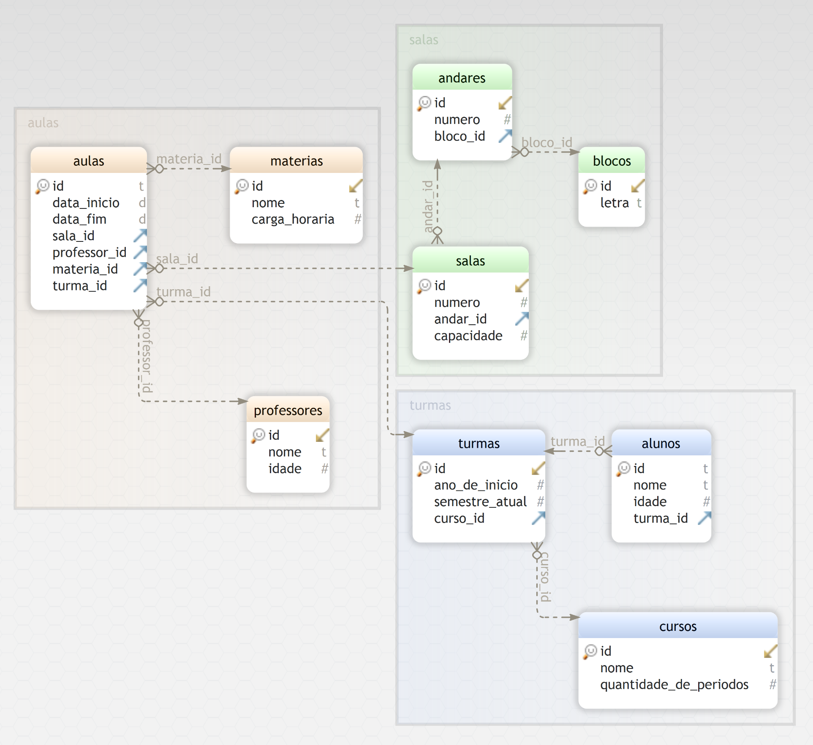
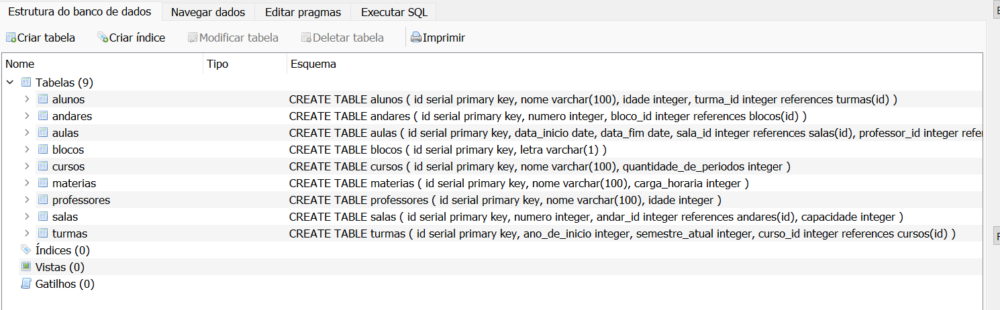
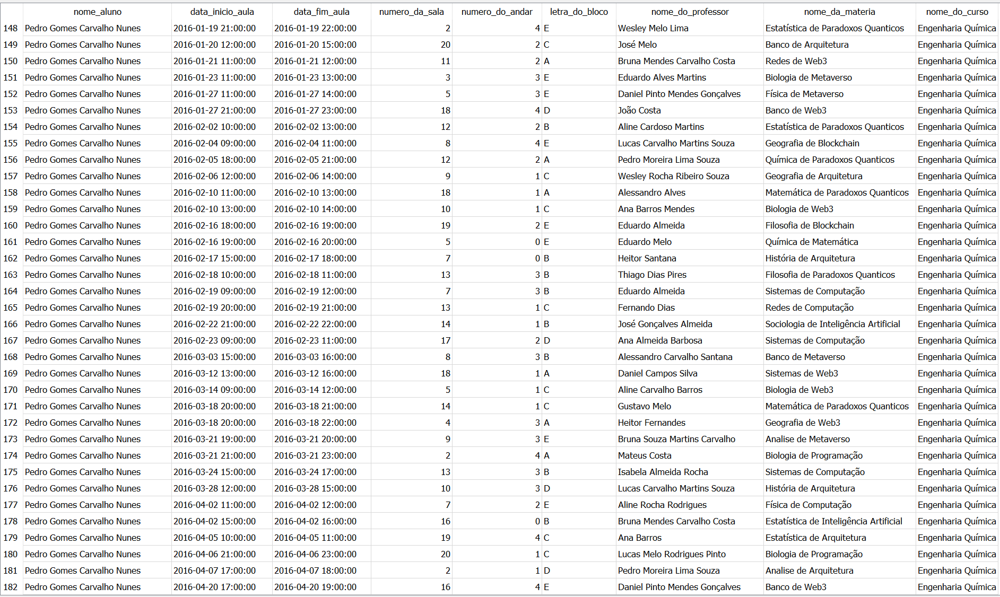

# College Database Example


Este é um exemplo de banco de dados relacional de uma universidade com valores procedurais.

Existem as entidades professor, matéria, curso, bloco, andar, sala, turma, aluno e aula conforme o schema a seguir:

<!-- add img -->


## Criar e usar o banco

O banco utilizado nesse exemplo é o Sqlite.

Para criar o banco crie um arquivo chamado `banco.db`

<!-- https://sqlitebrowser.org/ -->
Você pode editar o schema e realizar queries no banco com a ferramenta [DB Browser for SQLite](https://sqlitebrowser.org/)

O arquivo `create_entities.sql` cria as entidades do banco, você pode executar esse script pelo DB Browser para criar as entidades iniciais.



## População do banco

O script `seed.py` popula o banco com dados aleatórios e concisos.
```sh
python3 seed.py
```



## Consultas

O arquivo `queries.sql` contém consultas exemplo para você testar o banco:

```sql
...
-- quais sao os alunos, em qual turma e em qual curso estao?
select
       alunos.nome as nome_do_aluno,
       turmas.ano_de_inicio as ano_de_inicio,
       cursos.nome as nome_do_curso
from
       alunos
       join turmas on alunos.turma_id = turmas.id
       join cursos on turmas.curso_id = cursos.id;
...
```

## Gerar Diagrama Entidade-Relacionamento

Para gerar o diagrama foi utilizado o programa [DbSchema](https://dbschema.com/download.html).

É possivel selecionar o arquivo .db final ou o .sql com a definição de esquema, e o app gera o diagrama automaticamente.

## Casos reais

Esse é apenas um banco modelo básico, mas que pode ser bem útil para testes.

SQLite é a versão mais simples de um banco relacional, mas caso necessário é possivel migrar os dados de maneira rápida para outros bancos:

- PostgreSQL: https://pgloader.readthedocs.io/en/latest/ref/sqlite.html

- MySQL: https://stackoverflow.com/questions/18671/quick-easy-way-to-migrate-sqlite3-to-mysql

- AWS RDS: https://aws.amazon.com/premiumsupport/knowledge-center/rds-import-data/

- Azure SQL: https://docs.microsoft.com/en-us/azure/azure-sql/database/migrate-sqlite-db-to-azure-sql-serverless-offline-tutorial?view=azuresql

- Google Cloud SQL: https://stackoverflow.com/questions/43076090/how-to-export-sqlite-database-to-google-cloud-sql

- MongoDB: https://stackoverflow.com/questions/19342862/export-database-from-sqlite-to-mongodb